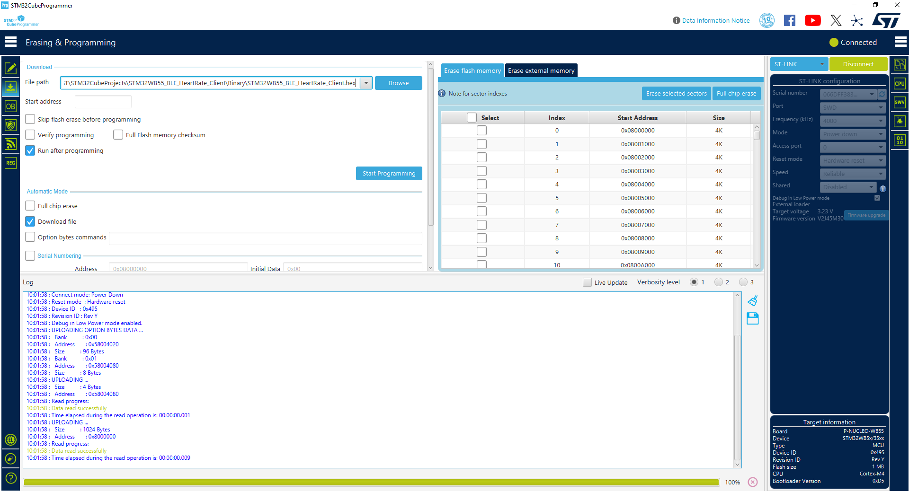
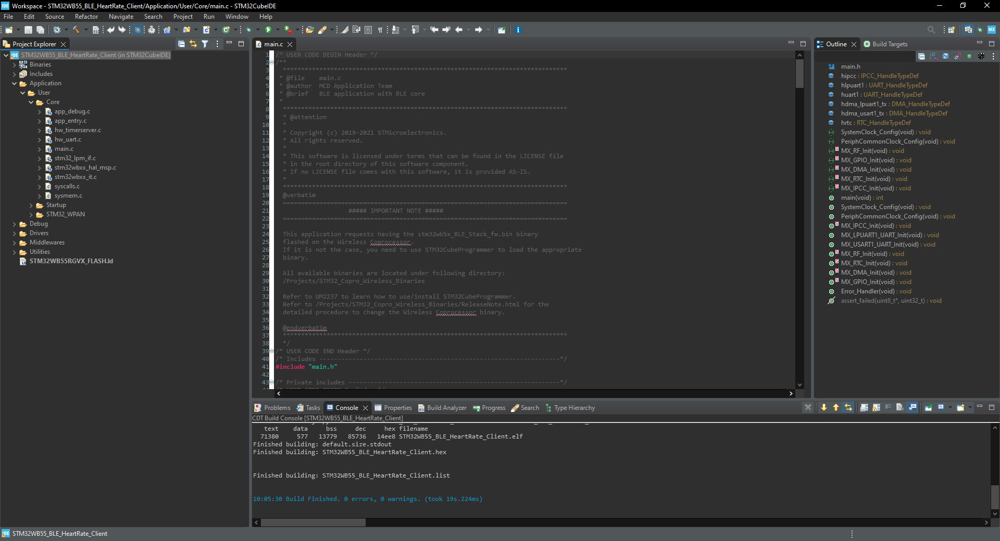
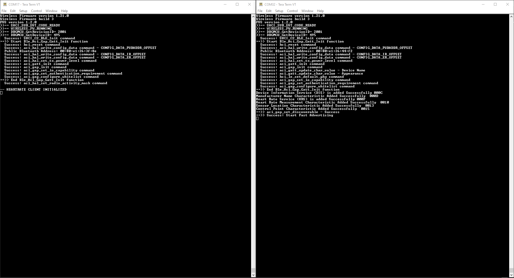
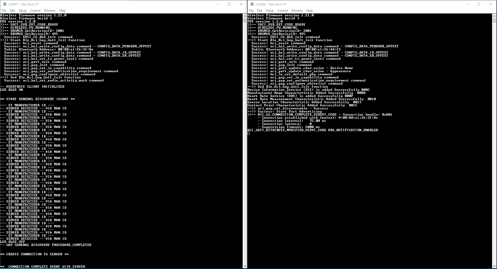
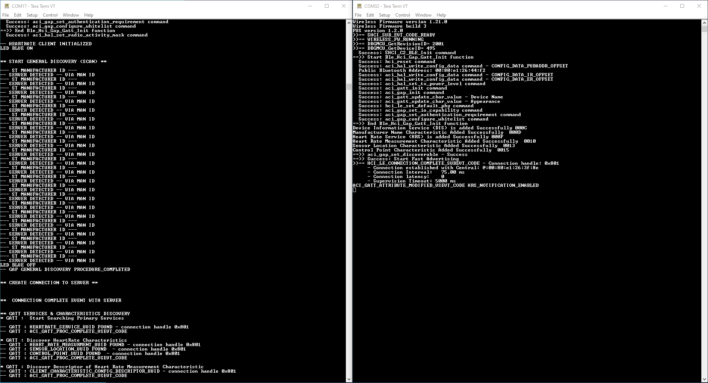
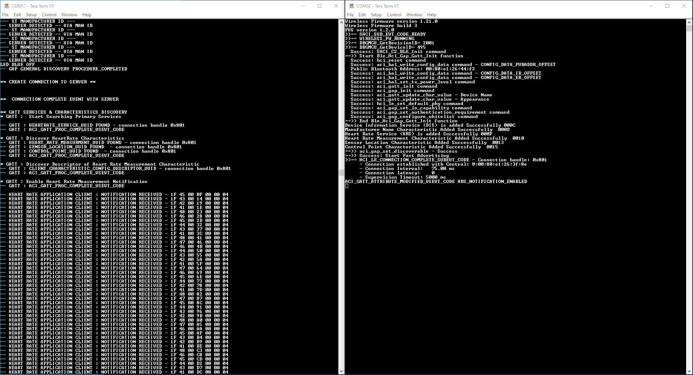
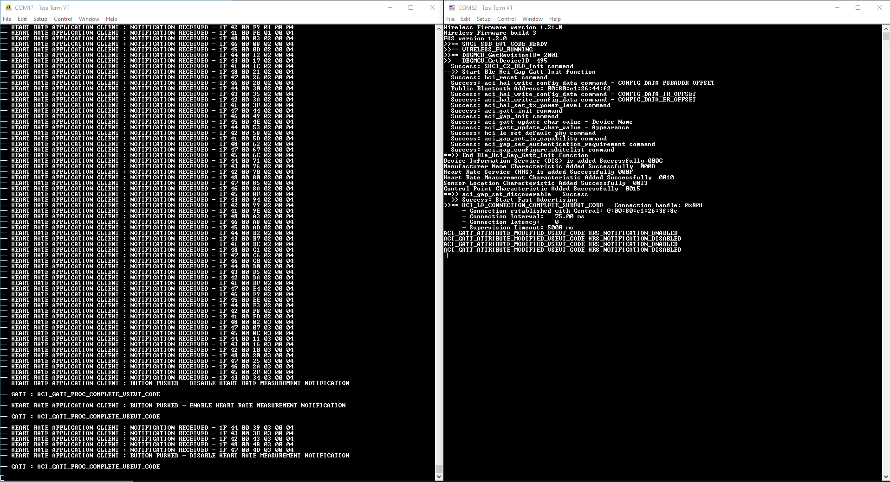
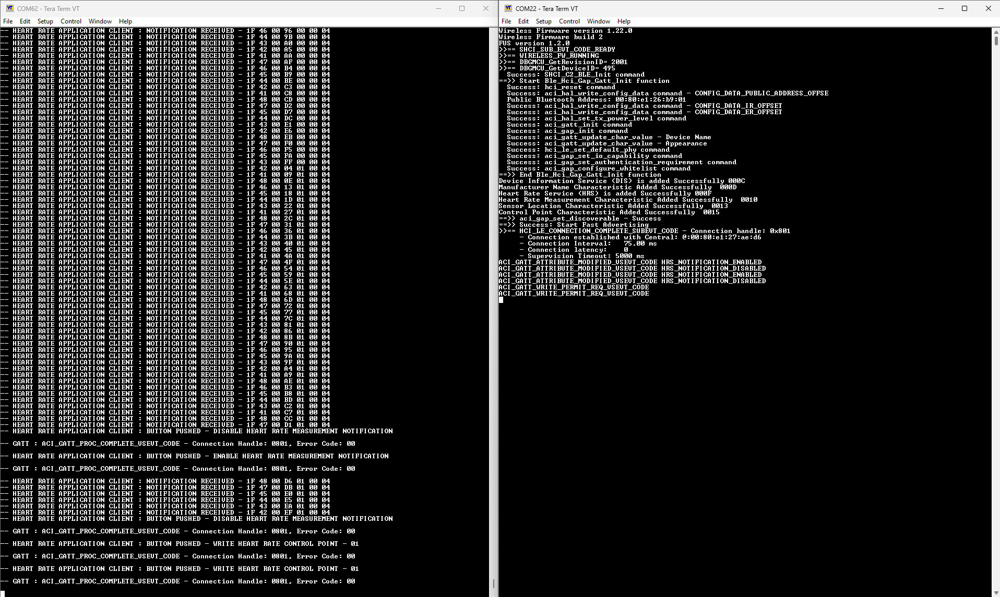
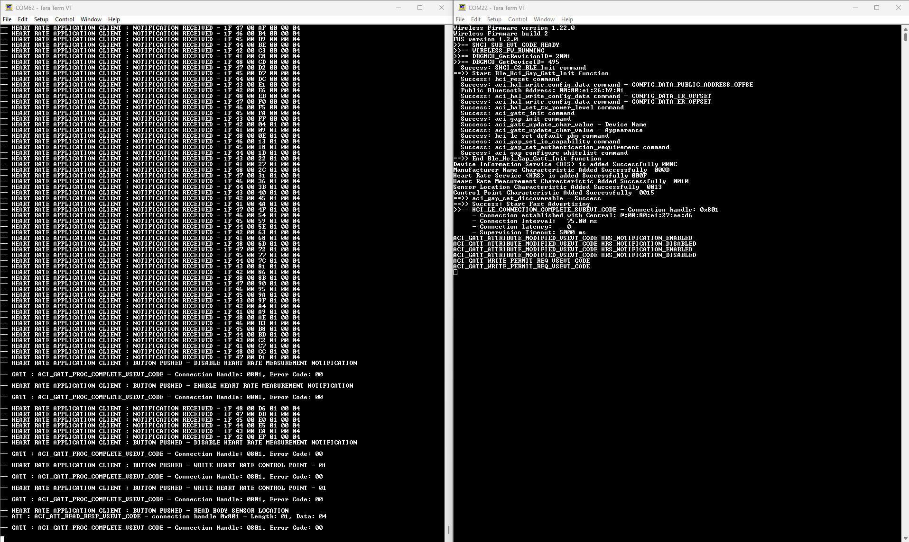

# STM32WB55_BLE_HeartRate_Client

**Author** : [Claudio Vertemara](https://github.com/ClaudioVertemara)

* The STM32WB55_BLE_HeartRate_Client is based on the BLE_P2PClient application from STM32CubeWB V1.21.0.
* This application is an example of a BLE Client for the BLE_HeartRate project from STM32CubeWB.
* This project has the following button functionality:
    * SW1 (Disconnected) : Start BLE scanning and automatic connection.
    * SW1 (Connected)    : Send a BLE write to the Heart Rate Control Point characteristic.
    * SW2 (Disconnected) : No functionality.
    * SW2 (Connected)    : Send a BLE read request to the Body Sensor Location characteristic.
    * SW3 (Disconnected) : No functionality.
    * SW3 (Connected)    : Toggle the Heart Rate Measurement characteristic notifications.
* Check the BLE_HeartRate [WIKI page](https://wiki.st.com/stm32mcu/wiki/Connectivity:STM32WB_HeartRate) for information on the server application from STM32CubeWB.

## Hardware Needed

  * One BLE Client
    * [NUCLEO-WB55RG](https://www.st.com/en/evaluation-tools/nucleo-wb55rg.html) for STM32WB55_BLE_HeartRate_Client

  * One BLE Server
    * [NUCLEO-WB55RG](https://www.st.com/en/evaluation-tools/nucleo-wb55rg.html) for [Nucleo BLE_HeartRate](https://github.com/STMicroelectronics/STM32CubeWB/tree/master/Projects/P-NUCLEO-WB55.Nucleo/Applications/BLE/BLE_HeartRate)

      or

    * [P-NUCLEO-WB55](https://www.st.com/en/evaluation-tools/p-nucleo-wb55.html) USB Dongle for [USB Dongle BLE_HeartRate](https://github.com/STMicroelectronics/STM32CubeWB/tree/master/Projects/P-NUCLEO-WB55.USBDongle/Applications/BLE/BLE_HeartRate)

      or

    * [STM32WB5MM-DK](https://www.st.com/en/evaluation-tools/stm32wb5mm-dk.html) for [STM32WB5MM-DK BLE_HeartRate](https://github.com/STMicroelectronics/STM32CubeWB/tree/master/Projects/STM32WB5MM-DK/Applications/BLE/BLE_HeartRate)

## Software Needed

  * Prebuilt firmware image: STM32WB55_BLE_HeartRate_Client.hex (STM32WB55_BLE_HeartRate_Client\Binary)

  * [STM32CubeWB](https://www.st.com/en/embedded-software/stm32cubewb.html)

  * [STM32CubeProgrammer](https://www.st.com/en/development-tools/stm32cubeprog.html)

  * IDE (Optional)

    * [STM32CubeIDE](https://www.st.com/en/development-tools/stm32cubeide.html)

    * [IAR EWARM](https://www.iar.com/products/architectures/arm/iar-embedded-workbench-for-arm/)

    * [Keil MDK-ARM](https://developer.arm.com/Tools%20and%20Software/Keil%20MDK)

  * [Tera Term](https://teratermproject.github.io/index-en.html) (Optional)

## User's Guide

1) Flash the NUCLEO-WB55 with the application using one of the following methods:

    a) Flash the prebuilt firmware image with STM32CubeProgrammer.

    

    b) Build and debug the application with an IDE.

    

2) View the debug log output using Tera Term, you may need to press the reset button to view the inital logs (optional).

    a) Left: BLE Heart Rate Client

    b) Right: BLE Heart Rate Server 
    
    > Note: CFG_LPM_SUPPORTED, CFG_DEBUG_BLE_TRACE, & CFG_DEBUG_APP_TRACE in app_conf.h will need to be modified to see the logs for the BLE_HeartRate example.

3) Press SW1 on the STM32WB55_BLE_HeartRate_Client device to start scanning and automatic connection.

4) The STM32WB55_BLE_HeartRate_Client will perform service, characteristic, and descriptor discovery upon connection.

5) The Heart Rate Measurement notifications will be enabled upon connection as well. 

6) Press SW3 on the STM32WB55_BLE_HeartRate_Client device to toggle the Heart Rate Measurement notifications.

7) Press SW1 on the STM32WB55_BLE_HeartRate_Client device to send a BLE write to the Heart Rate Control Point characteristic.

8) Press SW2 on the STM32WB55_BLE_HeartRate_Client device to send a BLE read request to the Body Sensor Location characteristic.

## Troubleshooting

**Caution** : Issues and the pull-requests are **not supported** to submit problems or suggestions related to the software delivered in this repository. The STM32WB55_BLE_HeartRate_Client example is being delivered as-is, and not necessarily supported by ST.

**For any other question** related to the product, the hardware performance or characteristics, the tools, the environment, you can submit it to the **ST Community** on the STM32 MCUs related [page](https://community.st.com/s/topic/0TO0X000000BSqSWAW/stm32-mcus).